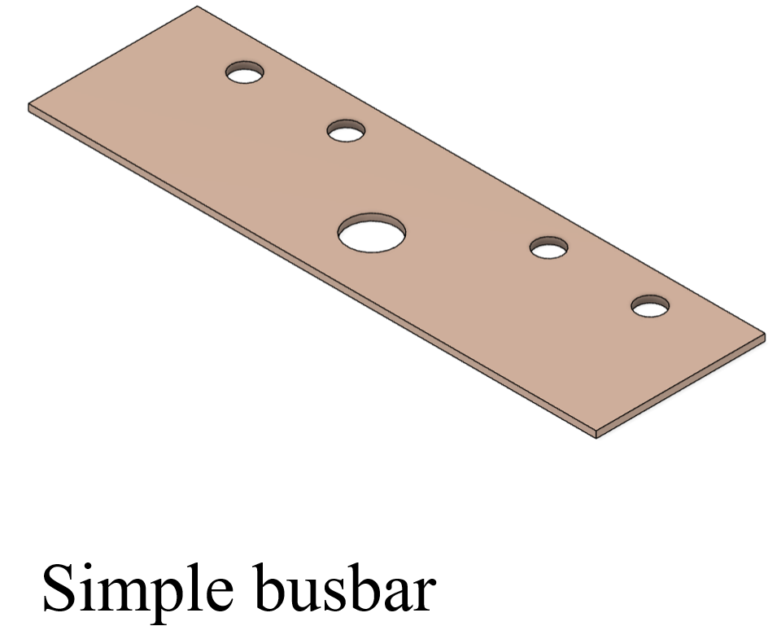
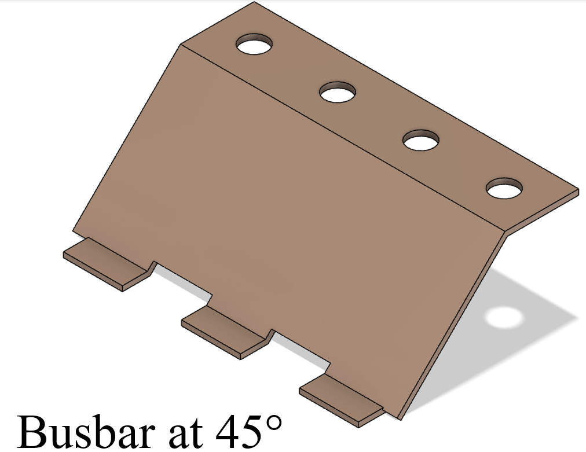
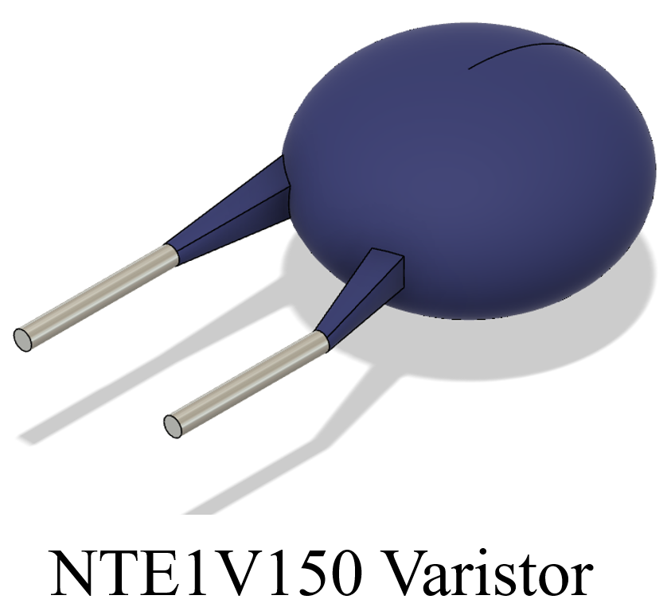
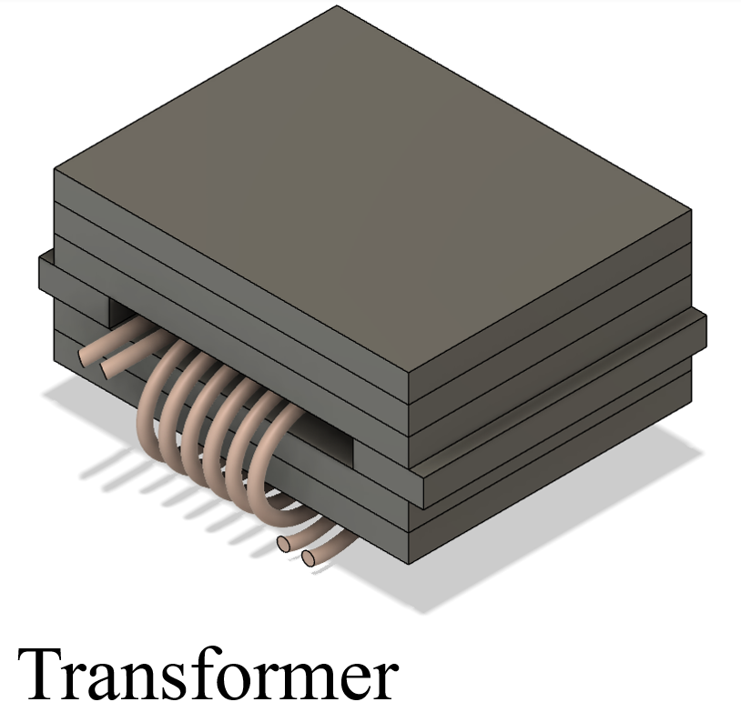

# My First Blog Post

Published on: 2023-10-12

The High Voltage Power Stage Project features a ... that serves to ... For this project, I made various 3D models as seen below.

1. **Smaller Models**: These are a few simple models that were used in larger assemblies that display my skill on working on smaller parts.

2. **Making Pages**: I then learned how to make pages by creating new `.astro` files and placing them in the `src/pages/` folder.

3. **Making Blog Posts**: This is my first blog post! I now have Astro pages and Markdown posts!

## What's next

I will finish the Astro tutorial, and then keep adding more posts. Watch this space for more to come.